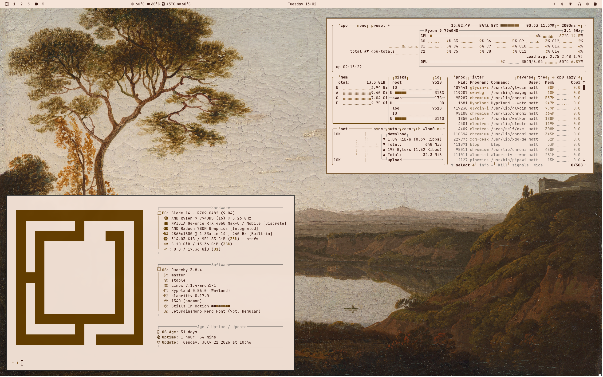
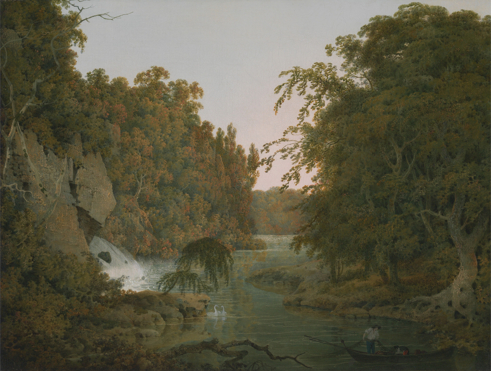
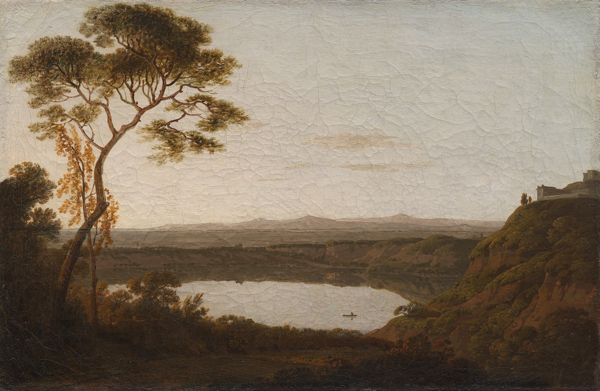
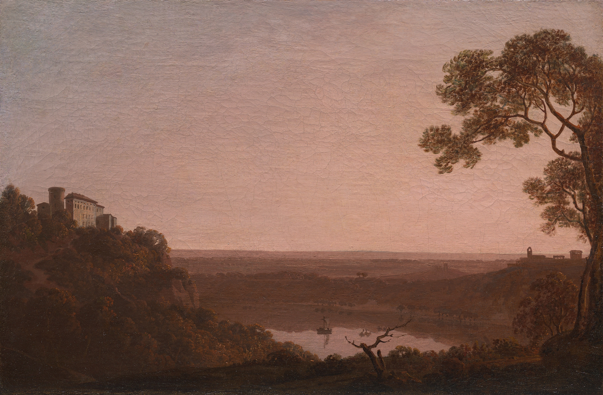
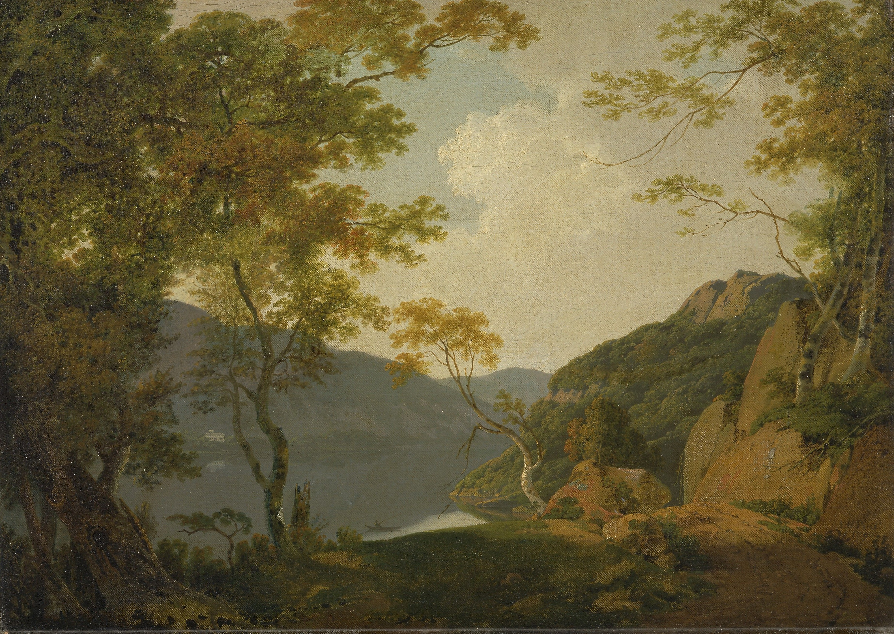
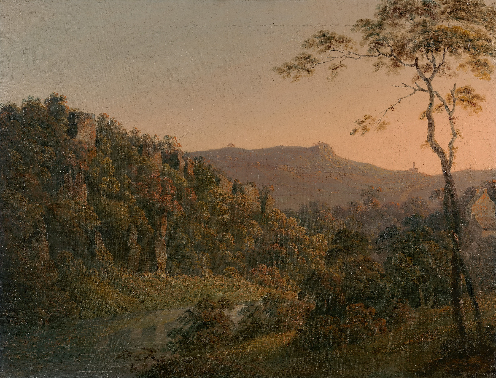

# Lakes & Light

A light Omarchy theme inspired by the landscape paintings of Joseph Wright.




## Inspiration

Joseph Wright of Derby (1734-1797) was one of Britain's most celebrated landscape painters. He was known for his use of light and his ability to capture the atmosphere of the natural world. The selected paintings showcase Wright's fascination with landscapes and light. The color palette is subtle and calming aesthetic for a clean desktop environment.
## Gallery

This project includes 6 carefully selected paintings:

| Preview                                                                                                                                         | Artwork                                                        |
| ----------------------------------------------------------------------------------------------------------------------------------------------- | -------------------------------------------------------------- |
|  | Derwent Water with Skiddaw in the Distance (between 1795–1796) |
|                                                                                                | Dovedale (1786)                                                |
|                                                                                | Lake Albano (1790–1792)                                        |
|                                                                    | Lake Nemi (between 1790–1795)                                  |
|                                                                                            | Lake Scene (1790)                                              |
|                                                              | Matlock Dale (between 1780–1785)                               |

## Color Palette

### Backgrounds


### Sepia Browns


### Earth Accents


## Components

- Aether
- Alacritty
- btop
- Chromium
- Foot
- Ghostty
- Hyprland
- Kitty
- Neovim
- Omarchy Shell (bar, lock screen, notifications, launcher, on-screen display)
- Vencord
- VS Code
- Warp
- Zellij

## Installation

Clone or install the project:
```bash
omarchy-theme-install https://github.com/mattbbia/lakes-and-light.git
```
### OR

1. Open the Omarchy menu (**Super + Alt + Space**).
2. Go to **Install > Style > Theme**.
3. Paste this repo URL: `https://github.com/mattbbia/lakes-and-light.git`
4. Hit Enter.

## Contributing

Contributions, bug reports, feature requests, and suggestions are welcome. Feel free to open an issue or submit a pull request.

## Support

If you enjoy this theme and would like to support future themes, you can:

- ⭐ Star this repository
- 💡 Suggesting new themes
- ☕ Supporting future themes

[](https://buymeacoffee.com/mattbbia)

## Acknowledgements

Artwork by **Joseph Wright of Derby (1734–1797)**. Images sourced from the **Yale Center for British Art** collection.

## License

This project is licensed under the MIT License. See the LICENSE file for details.